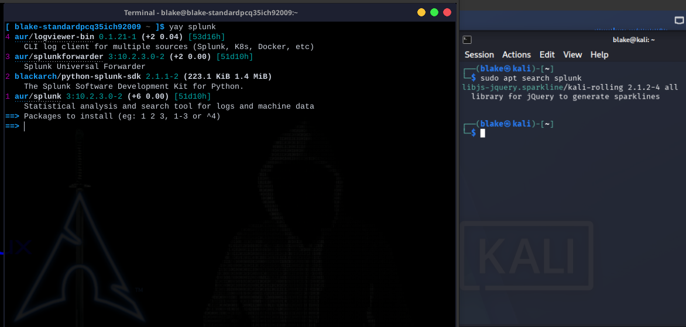
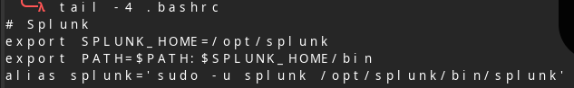
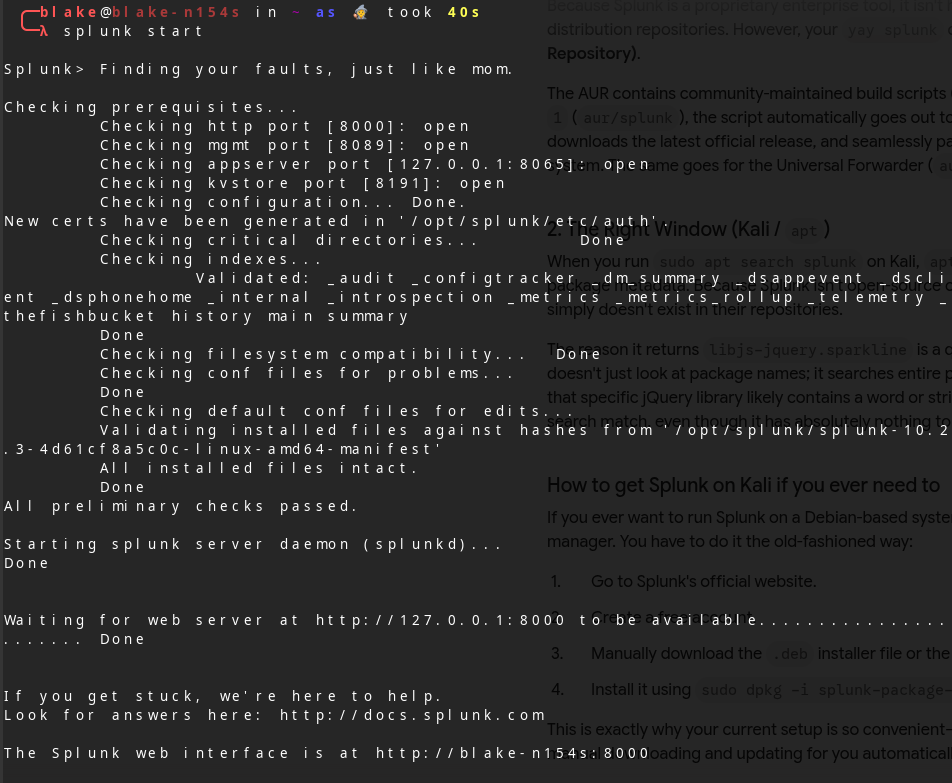
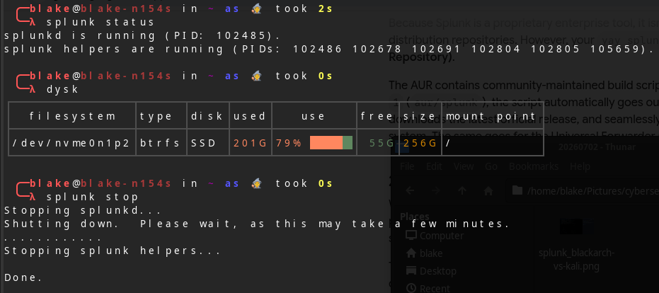
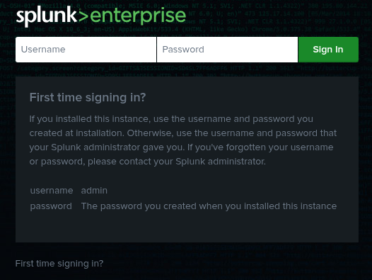
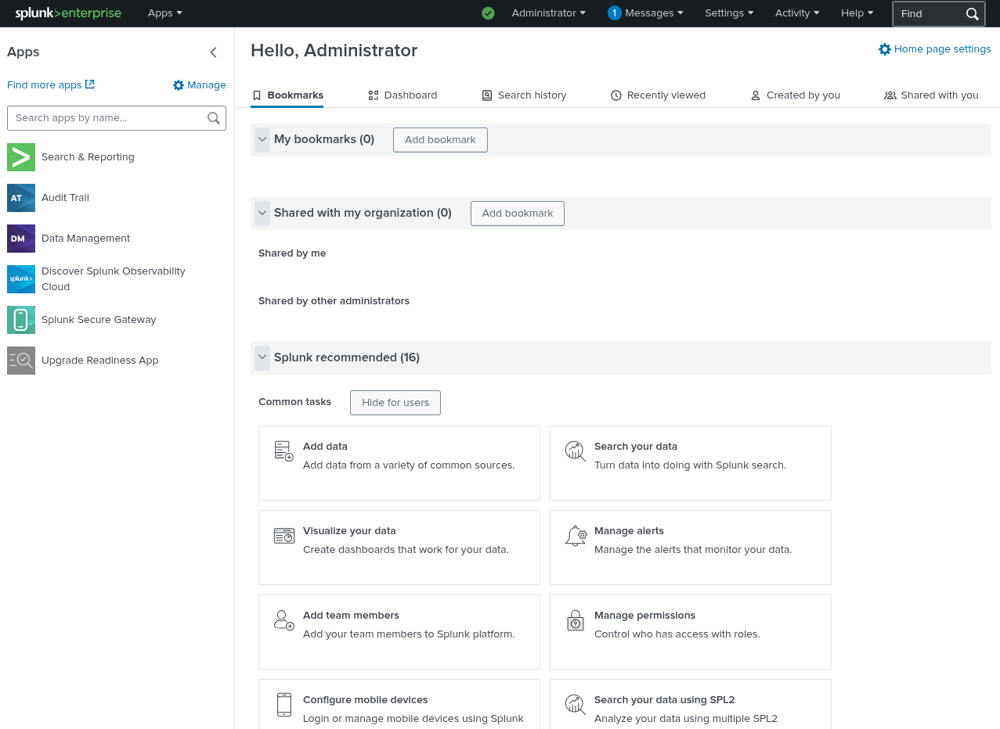

# Local Splunk Enterprise Deployment on Garuda Linux (Arch-based)

This repository documents my local deployment and configuration of Splunk Enterprise on an Arch-based Linux distribution (Garuda Linux). It details the post-installation configuration steps required to initialize the service and optimize the command-line interface for efficient administration.

## Installation & Post-Setup Discovery

One of the major advantages of using an Arch-based distribution is the ability to fetch and install packages directly from the terminal via the Arch User Repository (AUR), a convenience not natively shared by Debian-based distributions like Kali, which require manual package downloads.



While the installation completed without error, Splunk does not automatically generate desktop environment menu shortcuts. Investigation revealed that the package installs directly into the `/opt` directory (similar to how XAMPP deploys on Linux systems). 

By default, the `splunk` binary is not added to the user's global path environment. 

---

## Service Initialization

To initialize the environment, accept the software license, configure the primary administrative account, and manage the system daemon, the following sequence was executed:

```bash
# 1. Switch to the dedicated splunk system user
sudo -u splunk -i

# 2. Run the initial configuration script to accept the license and establish admin credentials
/opt/splunk/bin/splunk start --accept-license

# 3. Start the Splunk systemd service
sudo systemctl start splunk

# 4. (Optional) Enable the service to initialize automatically on host boot
sudo systemctl enable splunk
```

## CLI Optimization via Shell Aliasing

To avoid the inefficiency of typing out absolute file paths or constantly navigating to `/opt/splunk/bin/`, I sought a method to invoke the binary globally.

Initially, creating a standard symbolic link (`ln -s`) encountered environment hurdles due to the specific permissions required by the splunk system user. The most robust and elegant solution was to map a custom alias inside the shell configuration file (`~/.bashrc`):



After reloading the shell configuration, this allows for seamless, direct management of the Splunk instance (starting, stopping, restarting, or checking daemon status) directly from any terminal prompt:





## Deployment Visuals




# cyberlab_20260702__splunk-installation
